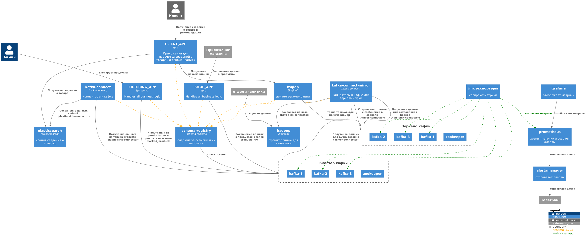

# yandex-kafka-final

## Схема проекта


## Компоненты

- основной Kafka-кластер (включён SASL_SSL PLAIN)
  - zookeeper
  - kafka-1
  - kafka-2
  - kafka-3

- зеркальный Kafka-кластер (включён SASL_SSL PLAIN)
  - zookeeper-mirror
  - kafka-mirror-1
  - kafka-mirror-2
  - kafka-mirror-3

- интерфейс для Kafka
  - kafka-ui

- реестр схем
  - schema-registry (хранит схемы в основной Kafka)

- система для аналитики и рекомендаций
  - ksqldb-server (рекомендует товары, которые пользователь ещё не смотрел. [см. скрипты](./_compose_data/ksql-init.sql))

- коннекторы
  - kafka-connect (смотрит на основную кафку, для [elastic-sink-connector](./_compose_data/elastic-sink-connector.json))
  - kafka-connect-mirror (смотрит на зеркало кафки, для [hdfs-sink-connector](./_compose_data/hdfs-sink-connector.json) и [mirror-connector](./_compose_data/mirror-connector.json))

- мониторинг и алертинг
  - jmx-kafka-1 (для каждого брокера в основном кластере)
  - jmx-kafka-2
  - jmx-kafka-3
  - jmx-kafka-mirror-1 (для каждого брокера в зеркале кластера)
  - jmx-kafka-mirror-2
  - jmx-kafka-mirror-3
  - prometheus
  - kibana
  - grafana
  - alertmanager (настроена интеграция с телеграм)

- консольное приложение для выгрузки данных от магазинов из файла
  - shop_app

- консольное приложение для потоковой обработки заблокированных товаров и API для блокирования товаров. Сделано с помощью goka
  - filtering_app

- API для просмотра товаров и рекомендаций. За товарами идет в эластик, за рекомендациями в ksqldb
  - client_app

- БД для хранения данных по продуктам
  - elasticsearch

- hadoop, пытался сделать сначал спарк, но не получалось на java писать. оставил т.к. получилось перенести данные из кафка в хадуп и решил не удалять, чтобы не зря сделал
  - hadoop-datanode-1
  - hadoop-namenode

- инциилизирующие приложения
  - kafka-init (выдает права и создает топики)
  - kafka-connect-init (добавляет коннекторы)
  - ksqldb-init (создаем потоки и таблицы)

## Как запустить проект:

```
docker compose up -d
```

## Проверяем работоспособность
### 1. Как проверить блокирование продуктов

1. Откройте [filtering_app](http://localhost:8099/api/docs), если не открывается — значит приложение ещё инициализируется, нужно попытаться ещё раз попозже. То, что приложение инициализируется, можно проверить в логах приложения `filtering_app`.
2. В ручке `PUT blocked-products/{productId}` введите productId `20001` и выполните
3. Найдите файл [data_rest.json](./_compose_data/data_rest.json), скопируйте содержимое и замените им содержимое [data.json](./_compose_data/data.json), затем сохраните файл
4. Запустите контейнер `shop_app` ещё раз — он загрузит новые данные в Kafka
5. Откройте [kafka-ui](http://localhost:8080/ui/clusters/kafka/all-topics/products/messages) — там не будет продукта с ключом `20001`, в то время как в топике [products-raw](http://localhost:8080/ui/clusters/kafka/all-topics/products-raw/messages) он будет

### 2. Проверяем получение данных
1. Откройте [client_app](http://localhost:8098/api/docs)
2. В ручке `GET product` введите name `Наушники AirBeat Pro` и любой X-User-Id латиницей
3. Придёт ответ с данными по продукту

### 3. Проверяем получение рекомендаций
1. Откройте [client_app](http://localhost:8098/api/docs)
2. В ручке `GET recommendations` вставьте X-User-Id, который вводили в `GET product`
3. Будут выданы рекомендации: все продукты, которые пользователь ещё не искал
4. Также рекомендации можно посмотреть в топике [USERS_RECOMENDATIONS](http://localhost:8080/ui/clusters/kafka-mirror/all-topics/USERS_RECOMENDATIONS/messages)

### 4. Проверяем копирование данных в Hadoop
1. В [Hadoop File Explorer](http://localhost:9870/explorer.html#/data/topics) смотрим, что загрузились данные топиков `products`, `products-raw`, `blocked-products`, `blocked-products-group-table`, `client-actions`

### 5. Проверяем мониторинг
1. Заходим в [grafana](http://localhost:3001/dashboards)
2. Креды: admin / admin
3. На предложение о смене пароля жмём `skip`
4. Видны [дашборды](http://localhost:3001/dashboards)
5. Дашборды настроены на 2 кластера (env): `cluster-kafka` и `cluster-kafka-mirror`

### 6. Проверяем алерты
1. Заходим в [alertmanager](http://localhost:9093/#/alerts)
2. Во второй вкладке открываем [алерты Prometheus](http://localhost:9090/alerts)
3. Выключаем в Docker все 3 брокера `kafka` или `kafka-mirror`
4. Ждём, когда [алерт Prometheus](http://localhost:9090/alerts) станет `pending` (F5 страницы)
5. Ждём ещё 2 минуты
6. [Алерт Prometheus](http://localhost:9090/alerts) станет `firing`
7. В [alertmanager](http://localhost:9093/#/alerts) увидим, что появился алерт, можно развернуть подробности кнопкой `Info`
8. Мне придёт алерт в Telegram :)
9. Включаем брокеры обратно для дальнейшей работы